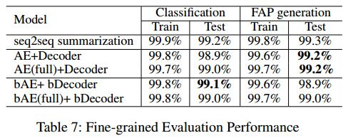
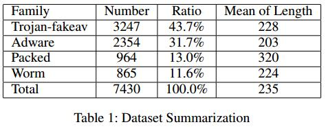
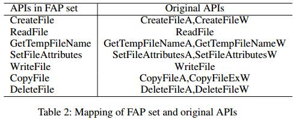
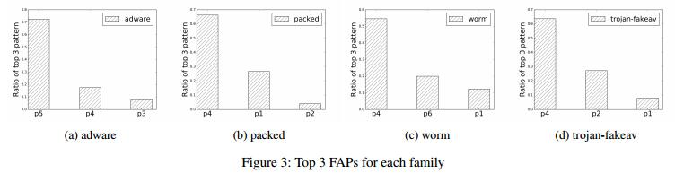
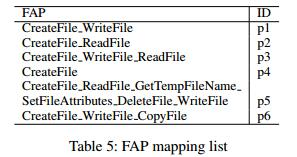
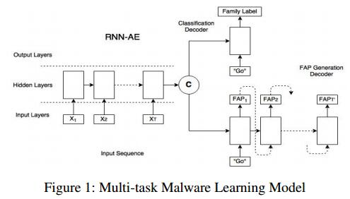

read time: 2017-04-07
* paper title: A multi-task learning model for malware classification with useful file access pattern from API call sequence  
* paper authors: Xin Wang, Siu Ming Yiu  

## Content

* [Question](#question)

* 1. [results](#1-results)

* 2. [datasets and features](#2-datasets-and-features)

* 3. [model](#3-model)

* 4. [others](#4-others)

    

## Question
------------------------------------------------------------------------------------
1. 模型如何建立的？只是修改了seq2seq的设置？  
2. 粗略估计中，既然无监督学习，哪来的标签？  
3. FAP是如何生成的？内部是什么结构，含义？  
4. API调用序列和FAP的区别和联系是什么？  
5. model具体的运行方式，RNN-AE抽取特征后，decoder是并行进行，还是先生成FAP？
Classifier的输入是什么？如果输入不是FAP，那么FAP在本文中生成的意义是什么？  
  

## 1 results
------------------------------------------------------------------------------------
  
其中AE(full)指的是完整的数据集，AE指的是只用训练集。  
  

## 2 datasets and features
------------------------------------------------------------------------------------
data from: a public malware API call sequence dataset(http://ocslab.hksecurity.net/apimds-dataset)  
  
### Define of FAP
将具有相似功能的API合并成一个。如下图所示。  
  
example： FAP set S={a, b, c, d} and V[i]=[1, 0, 1, 1], then S[i]={a, c, d} and P[i]='acd'   
  
  
上述两图显示了不同家族恶意软件的不同FAP分布。
  

## 3 model
-------------------------------------------------------------------------------------
  
一个autoencoder进行表示学习，两个decoder分别用来分类和FAP生成。如上图所示。  
先用RNN-AE做特征抽取，将我们拿到的API序列输入到RNN-AE中，让其自动选择特征。  
  

## 4 others
--------------------------------------------------------------------------------------
  

