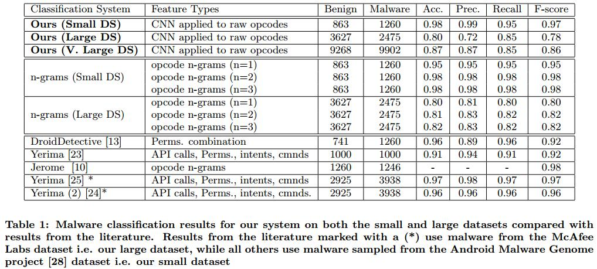
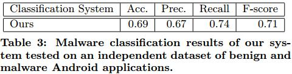
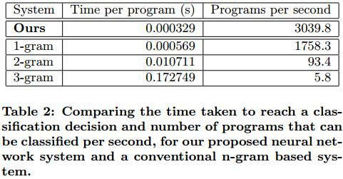
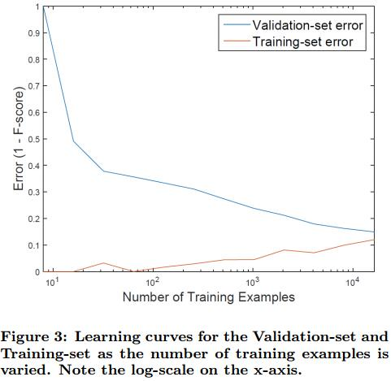
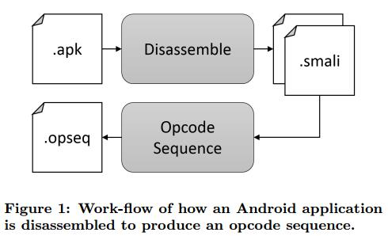
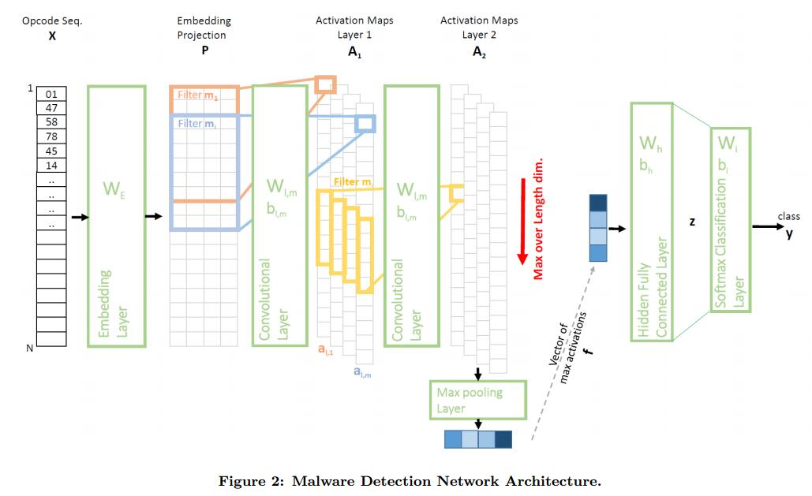

read time: 2017-07-05
* paper title: Deep Android Malware Detection  
* paper authors: Niall McLaughlin, Jesus Mar tinez del Rincon, etc  
* paper keywords: Malware Detection, Android, Deep Learning  

## Content
* 1. [results](#1.-results)
	* 1.1 [Full results](####-1.1-full-results)
	* 1.2 [Realistic Testing results](####-1.2-realistic-testing-results)
	* 1.3 [Computational Efficiency](####-1.3-computational-efficiency)
	* 1.4 [Learning Curves](####-1.4-learning-curves)

* 2. [datasets and features](#2.-datasets-and-features)
	* 2.1 [datasets](####-2.1-datasets)
	* 2.2 [features](####-2.2-features)

* 3. [model](#3.-model)
	* 3.1 [How to get the features](#3.1-how-to-get-the-features)
	* 3.2 [Full Network Architecture](####-3.2-full-network-architecture)
		* 3.2.1 [Opcode Embedding Layer](#####-3.2.1-opcode-embedding-layer)
		* 3.2.2 [Convolutional Layers](#####-3.2.2-convolutional-layers)
		* 3.2.3 [Classification Layers](#####-3.2.3-classification-layers)

* 4. [others](#4)
    

### 1. results
------------------------------------------------------------------------------------
#### 1.1 Full results 
>
  

#### 1.2 Realistic Testing results 
> 
  

#### 1.3 Computational Efficiency 
>
  

#### 1.4 Learning Curves 
>
  

### 2. datasets and features
-------------------------------------------------------------------------------------
#### 2.1 datasets
>Small Dataset: Android Malware Genome project - 863 benign & 1260 malware  
>Large Dataset: McAfee Labs - 3627 benign & 2475 malware   
>V. Large Dataset: Mcfee Labs - 9268 benign & 9902 malware   

#### 2.2 features
>based on static analysis of the raw opcode sequence from a disassembled program.   
>基于对一个反编译后的程序的原始操作码序列的静态分析。  
  

### 3. model
------------------------------------------------------------------------------------------------
>CNN model.  
#### 3.1 How to get the features
>  
先将apk文件反编译，得到apk的所有资源文件(其中的.smali文件内的语法使用Dalvik虚拟机指令语言)。
之后，从.smali文件中提取每个method的操作码序列，组合得到当前smali文件(一个class)的特征数据集。
最后，所有的smali文件提取的操作码序列汇集得到单个apk文件的操作码序列。(？汇集的规则是怎样)  

#### 3.2 Full Network Architecture
>  

##### 3.2.1 Opcode Embedding Layer
one-hot编码操作码序列，X[n]是第n个向量表示的操作码；通过查看Dalvik文档，向量的维数(dimension)是218维。
X[n]乘一个权重矩阵W(随机初始化)后，将操作码映射到一个k维的Embedding空间中，得到P[i]矩阵。
>>这样做的目的是：让网络可以在一个连续的k维空间中学习到每个操作码的正确表示。
Embedding空间的维数会影响网络表示映射关系的能力，因此，使用更高的维度可以使网络具有更强的灵活性去学习高维的非线性映射关系。  

##### 3.2.2 Convolutional Layers
第一个卷积层接受N*K的Embedding矩阵作为输入，更深层次的卷积层以之前卷积层的输出作为输入。
每个卷积层有M[l]个filter(第一层size是s[1]*k，更深层的size是s[l]*M[l-1])，这意味着第一层的filter可以检测s[l]个操作码。
在样例前向传播的时候，每个filter都会产生一个激活映射A[l,m](size是n*1)，所有的filter产生的组合在一起，构成矩阵A[l](size是n*M[l])
第一个卷积层的filter产生的矩阵P可以用下面的第一个公式表示:  
>  
在更深层次的卷积层中，使用A[l-1]作为l层的输入。经过最后的卷积层后，接着使用下面的公式进行maxpooling。  
>  
使得f的长度是M[l]（本文中的M[l]值为2）。  

##### 3.2.3 Classification Layers
卷积层的结果向量f，作为多层感知机(MLP)的输入-一个隐藏层和一个输出层全连接。
其中隐藏层使用Relu作为激活函数，最后输出Softmax归一化的概率值。  

### 4
--------------------------------------------------------------------------------------------------------------
  

