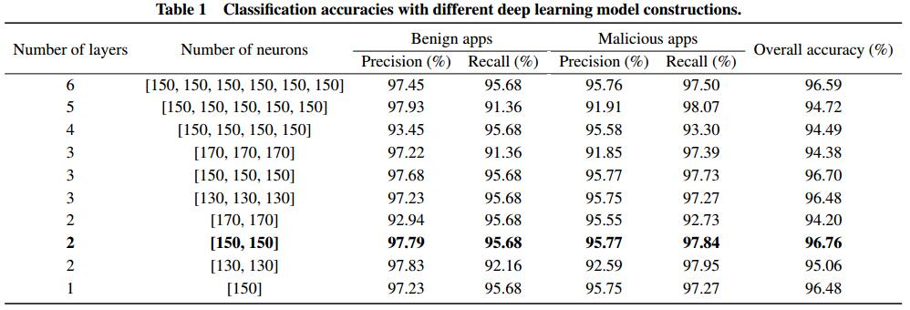

read time: 2017-03-29
* paper title: DroidDetector Android Malware Characterization and Detection  
* paper authors: Zhenlong Yuan, Yongqiang Lu, and Yibo Xue  
* paper keywords:  Android security; malware detection; characterization; deep learning; association rules mining  

## Content

* [Question](#question)

* 1. [results](#1-results)

* 2. [datasets and features](#2-datasets-and-features)

* 3. [model](#3-model)

* 4. [others](#4-others)

    

## Question
------------------------------------------------------------------------------------
>本文叙述比较清楚，各种对比实验做的比较充分，尤其对数据处理的部分，很值得学习。
  

## 1 results
------------------------------------------------------------------------------------
  
>上图是神经网络中不同的参数时，不同的结果。  
  
>上图是不同机器学习方法的对比实验，显示出了基于静态和动态结合作为特征，DBN作为model的组合方式具有最好的效果。  
  
>上图是不同比例的apps的结果。  
  

## 2 datasets and features
------------------------------------------------------------------------------------
### datasets
>主要来自Google play store.  
### features
  
>特征包括三个部分：权限请求、敏感API、动态行为。其中前两个通过静态分析抽取。  
7-zip反编译apk文件，使用AXML-Printer2和粉刺工具TinyXml -> 获得app的权限请求；  
使用baksmali工具，获得敏感API；  
使用DroidBox沙箱(由TaintDroid发展而来)监控apk运行，获得了13个app的行为。
  

## 3 model
-------------------------------------------------------------------------------------
   
>传统的机器学习方法面临结构太浅的问题，而深度学习不同，深度学习可以构建出不同深度的架构。  
>本文使用深度置信网结构构造我们的深度学习模型、描述Android apps。如上图所示，This model包含两个阶段：无监督预训练阶段，有监督反馈传播阶段。  
预训练阶段，通过堆叠波尔茨曼机（RBM）建立的深度信念网是分层级的,生成新的训练数据。  
反馈传播阶段，不断更新参数。  
   
>1.用户提交文件  
>2.判断文件是否是合理、完整的Android app  
>3.静态分析（权限、敏感API）  
>4.动态分析  
>5.抽取到的特征进入训练后的模型  
>6.结果  
>7.支持度和置信度做评价  
   

## 4 others
--------------------------------------------------------------------------------------
>对不同比率的良性软件和恶意软件进行分析。因为真实环境中，良性软件和恶意软件不可能是等量的。
并且得到结果：良性软件相对恶意软件越多，结果的正确率越高。  
### 接下来需要做的工作
1. 抽取更有效的特征  
2. add semantic-based features  
3. 数据集少的问题  
  
