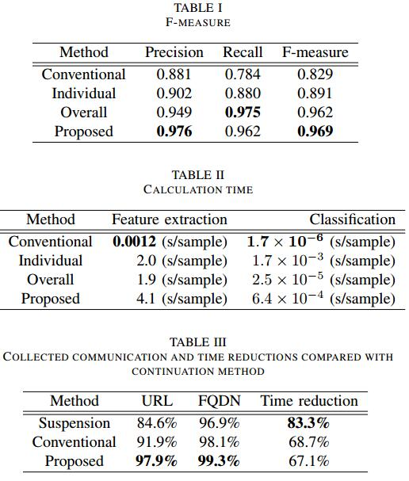
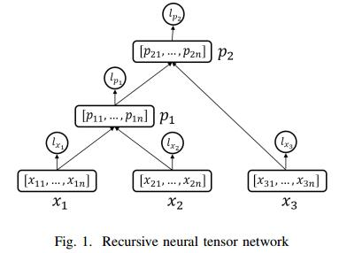
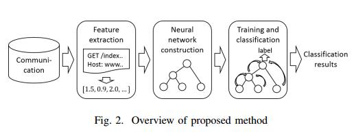

read time: 2017-04-12
* paper title: Efficient Dynamic Malware Analysis Based on Network Behavior Using Deep Learning  
* paper authors: Toshiki Shibahara, Taakeshi Yagi, Mitsuaki Akiyama, etc  

## Content

* [Question](#question)

* 1. [results](#1-results)

* 2. [datasets and features](#2-datasets-and-features)

* 3. [model](#3-model)

* 4. [others](#4-others)

    

## Question
------------------------------------------------------------------------------------
  

## 1 results
------------------------------------------------------------------------------------
  
>耗时降低了67.1%, Precision, Recall and F-measure见上图。
  

## 2 datasets and features
------------------------------------------------------------------------------------
### datasets
>从https://www.virustotal.com/收集所得。  

提出思想的关键是恶意软件交互的两个特征：交互目的的变化、公共潜在功能。  
  
本文提出的方法使用递归神经张量网络(recursice neural tensor network, RNTN)，其通过使用张量来提高RNN的性能。
张量使RNTN能够计算输入特征的高阶组合。RNTN的树状结构如上图所示。  

### 特征抽取
抽取5个domain-based特征和8个content-based特征，共计13个特征。  
提取出与domain相对应的IP地址位数，并解析其对应的地址等有意义的信息。提取应用协议，如DNS、HTTP。  
提取状态码，文件类型，查询参数的数量，路径深度，由恶意软件发送接受的通信字节数。  
使用Aoki等人提出的恶意URL检测方法确定HTTP和HTTPS通信的恶意性。  
根据上面收集到的信息，采用one-hot encoding矢量化，得到36维的特征向量。  
  

## 3 model
-------------------------------------------------------------------------------------
  
### 构建神经网络
考虑具有相同目的的交互的关系，以及具有不同目的的交互的关系。  初始环境中每个节点组成一个交互，根据以下三个规则选择创建任选两个节点的父亲节点，选中的两个节点从备选节点中去除，父亲节点加入到备选节点中，重复操作构建树状的神经网络：
* a)DNS and following HTTP(S)  
使用HTTP同一个域进行交互，与其对应的IP需要首先使用DNS协议。因此，相同的DNS和HTTP（HTTPS）被认为是具有相同的交互。
* b)Identical URL path and URL query parameters  
如果和服务器的交互失败，恶意软件会频繁使用备用的服务器。如果初始的服务器和备用的服务器一致，那么交互的路径和查询也认为是一致的。
如果交互的路径和查询是一致的，那么认为目的是一致的。将具有相同交互路径和查询的节点组合。
* c)Time difference of communications  
讲过上面的两步，候选节点被分成了多个具有各自特征的交互组。如果两个交互组有依赖关系，则一组发送到另一组。 
换句话说，交互组的发送周期不重叠。时间不重叠交互组应该是不同的目的。因此，我们组合了两个时期最接近的交互组。

### 训练分类
  

## 4 others
--------------------------------------------------------------------------------------
### Effectiveness
相比较传统的方法，本文的方法可以将服务器数量减少一半以上，所以分析时间会减少67.1%。 

### Limitations
我们提出的方法有两个限制：长睡眠和标签。  
如果恶意软件样本在动态分析开始后睡了很长时间，我们提出的方法是无法应用的。在这种情况下，我们有两个选择。一个是继续分析，直到恶意软件样本发送通信。另一个是暂停分析。两者都降低效率或穷尽。  
但是，这些恶意软件的百分比报告只有5.39％。在我们的评估中，我们无法将我们提出的方法应用于1.29％的恶意软件样本。所以这不是一个大问题。

### Conclusion
为了收集尽可能多的恶意软件通信，我们提出了一种基于网络行为来确定是否应暂停动态分析的方法。我们提出的方法通过在恶意软件样本停止活动时暂停分析来提高动态分析的效率。我们提出的方法背后的关键思想是识别恶意软件通信的两个特征：通信目的的变化和公共的潜在功能。为了利用这些特点，我们关注恶意软件通信和自然语言之间数据结构的相似性。从这个见解，我们应用了RNN，它对句子表现出很高的分类性能。  
在对29,562个恶意软件样本的评估中，我们提出的方法将分析时间缩短了67.1％，同时在连续全面分析上，收集的URL的覆盖率达到97.9％。
  
