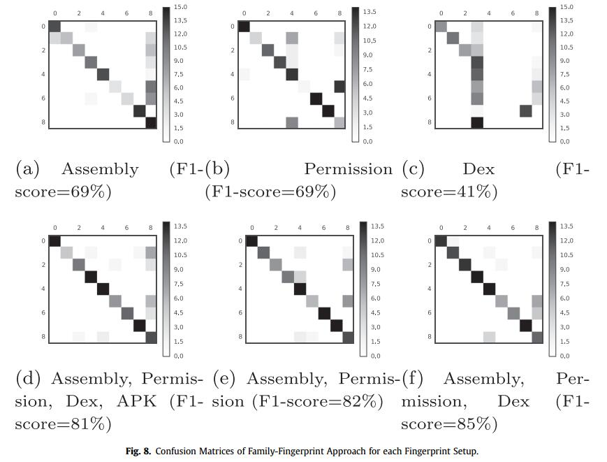
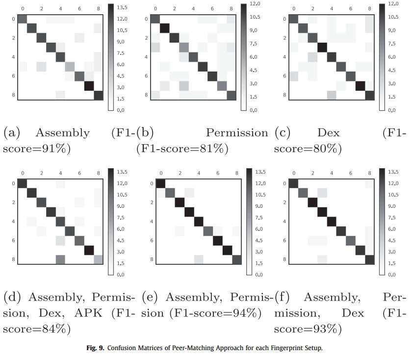
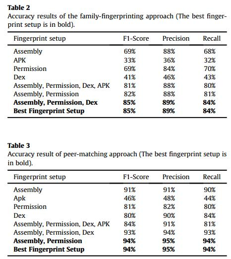
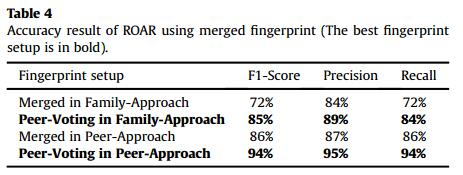
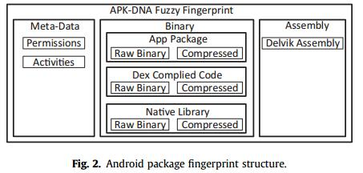
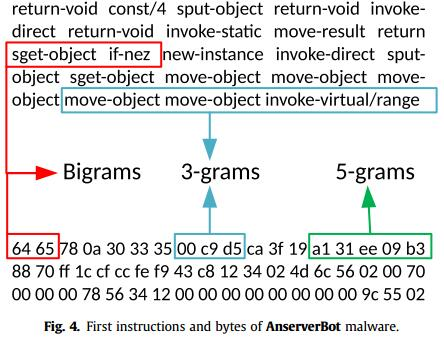
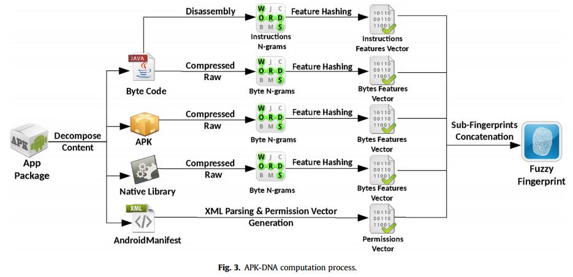
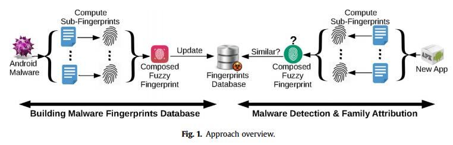
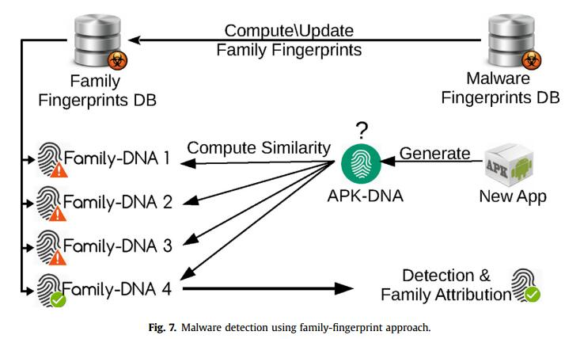

read time: 2017-03-20
* paper title: Fingerprinting Android packaging Generating DNAs for malware detection  
* paper authors: ElMouatez Billah Karbab, Mourad Debbabi, Djedjiga Mouheb  
* paper keywords: Fingerprinting, Malware, Mobile, Android, Fuzzy hashing, Detection, Family attribution  

## Content

* [Question](#question)

* 1. [results](#1-results)

* 2. [datasets and features](#2-datasets-and-features)

* 3. [model](#3-model)

* 4. [others](#4-others)

    

## Question
------------------------------------------------------------------------------------
>本文使用的数据集相对少。

Android的市场在过去几年受到指数的普及。不幸的是，这种激增的增长为每天针对Android设备的数千种恶意应用打开了大门。
此外，随着当今恶意软件日益复杂化，Android恶意软件指纹识别的传统hash技术的使用对于多种恶意应用程序的识别来说变得困难。
在模糊散列(fuzz hashing)技术的启发下，本文提出了Android包装APK的新颖全面的指纹识别方法。提出的指纹不仅可以捕获APK文件的二进制特征，还可以捕获应用程序的底层架构。 此外，我们利用这种指纹技术构建ROAR(一种用于Android恶意软件检测和家族归属的自动系统)。我们的实验表明，提出的指纹和ROAR系统的精度达到95％。
  

## 1 results
------------------------------------------------------------------------------------
  
>上图描述了选用不同特征时的F-score的值。

  
  
 
>assembly, permission and dex byte-code 的组合的结果最好。  
>对等投票比合并比较的结果更好。  
  

## 2 datasets and features
------------------------------------------------------------------------------------
### datasets
>Android Malware Genome Project (2015; Zhou and Jiang, 2012)  

  
>上图描述了我们需要构建的每一个apk文件的Fingerprint(即特征)的格式。
其中Meta-Data部分由反编译apk文件后从AndroidManifest.xml中获取软件所需要的权限组成。Binary中使用n-grams，分成上图的三个小部分(具体见下图)。

  

  
>上图描述了对于一个apk文件的处理流程。   
  

## 3 model
-------------------------------------------------------------------------------------
  
>利用数据集，按照上述的特征提取办法，建立特征数据库。
之后遇见无标签的数据，按照同样的特征处理办法进行处理，将提取的特征拿到数据库中进行比对，判断是否是恶意软件。数据集按照7：3的比例分配训练机和测试集。

>同样的方法，建立判断恶意软件家族的数据库。
  

## 4 others
--------------------------------------------------------------------------------------
family-fingerprinting两个缺点: 1.复杂, 2.对于快速更新的恶意软件库,同时需要快速更新family-fingerprint库。
peer-matching的缺点：可拓展性差。

系统的缺点：
1.只能针对已知的恶意软件类型进行判断，对于一些变种很难.
2.对与一些封装很复杂的恶意软件也很难判断.
3.对等匹配要比家族指纹的方法的准确率高。但是，对等匹配随着指纹数量线性增长；因此在当前的应用中，并没有包含native library，只是为了提高效率。
  
