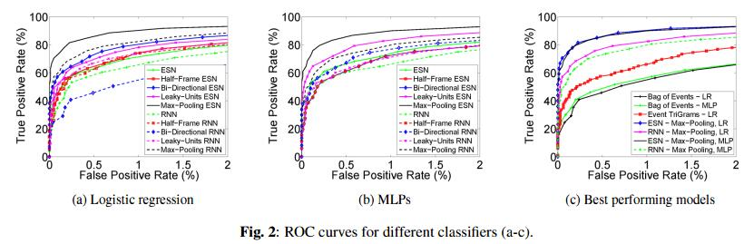
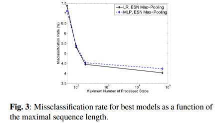
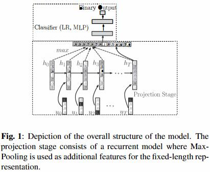

read time: 2017-04-19
* paper title: Malware Classification with Recurrent Networks  
* paper authors: Rasvan Pascanu, Jack W.Stokes, Hermineh Sanossian, Mady Marinescu, Anil Thomas  
* paper keywords: Malware Classification, Recurrent Neural Network, Deep Learning  

## Content

* [Question](#question)

* 1. [results](#1-results)

* 2. [datasets and features](#2-datasets-and-features)

* 3. [model](#3-model)

* 4. [others](#4-others)

    

## Question
------------------------------------------------------------------------------------
  

## 1 results
------------------------------------------------------------------------------------
  
可以看到在用不同的分类器的时候，FPR的值也是不同的。  
  
最好模型下，不同进程步数量、不同分类器的错误率。可以观察到，在使用ESN和Max-Pooling做特征抽取时，
最大进程步数量在200以下的时候，MLP和LR的分类能力近乎是相同的；但在300+之后，两个分类器出现了明显的差别。
Logistic Regression显示出了比MLP更好的分类能力。  

## 2 datasets and features
------------------------------------------------------------------------------------
微软内部数据：250000 malware & 250000 benign  
train, validation, test = 297500, 52500, 150000, 随机挑选数据。
  

## 3 model
-------------------------------------------------------------------------------------
  
由于长期依赖问题，仅仅使用ESN和RNN是不够的。为了克服这个问题，本文引入了Max-Pooling和Half-Frame。   
### Max-Pooling
是非线性下采样的一种形式，之前广泛应用在CNN中用于图像识别。我们使用Max-Pooling来增加我们进入系统分类阶段的固定长度表示形式的不变性。  
### Half-Frame
我们也使用该模型的中间状态，而不仅仅在序列结尾使用状态信息来确定序列是否包含恶意活动。  

## 4 others
--------------------------------------------------------------------------------------
  
