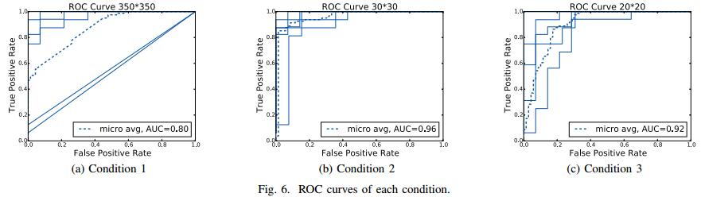

read time: 2017-05-24
* paper title: Malware Detection with Deep Neural Network Usinig Process Behavior  
* paper authors: Shun Tobiyama, Yukiko Yamaguchi, Hajime Shimada, etc  
* paper keywords: malware infection detection, neural network, process behavior  

## Content

* [Question](#question)

* 1. [results](#1-results)

* 2. [datasets and features](#2-datasets-and-features)

* 3. [model](#3-model)

* 4. [others](#4-others)

    

## Question
------------------------------------------------------------------------------------
  

## 1 results
------------------------------------------------------------------------------------
> 通过比较ROC曲线，得到了最好的情况下，AUC=0.96  
  
  

## 2 datasets and features
------------------------------------------------------------------------------------
> RNN 抽取进程行为的特征，并将其构造成图像的格式
> CNN 分类特征图片
  

## 3 model
-------------------------------------------------------------------------------------
  

## 4 others
--------------------------------------------------------------------------------------
  
